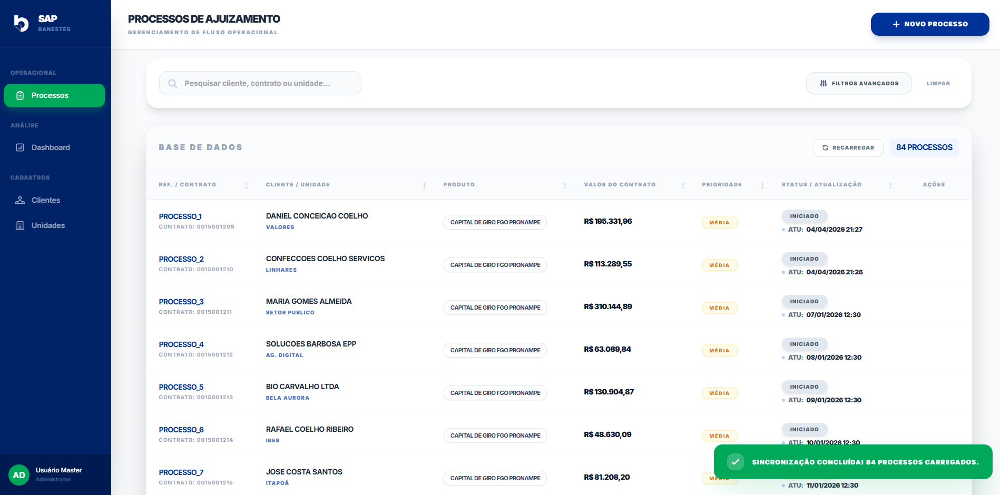
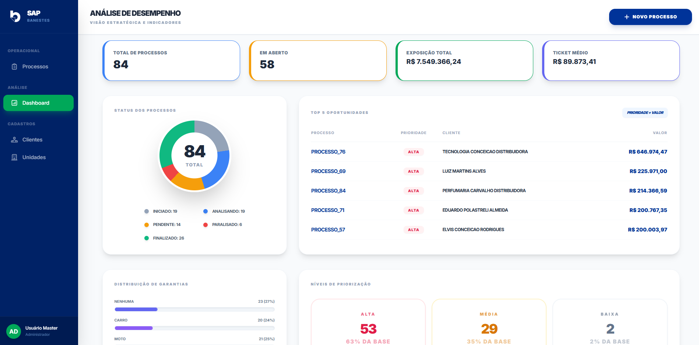

# SAP Banestes - Sistema de Acompanhamento de Processos

Este projeto consiste em um **Sistema de Acompanhamento de Processos (SAP)** desenvolvido como solução para o desafio técnico do Banestes. O objetivo é gerenciar o fluxo de ajuizamento bancário, automatizando a triagem de processos com base em viabilidade financeira e garantias reais.

---

## 🔗 Links do Projeto

- **Aplicativo em Execução:** [Acesse o Web App aqui](https://script.google.com/macros/s/AKfycbw-89LqyUJh2nd4HD8cUX1V9_-HVJk09jCWWehbpMeFmMgnBLd1IjkFTkolLSKqN3mpTw/exec)
- **Banco de Dados (Google Sheets):** [Visualize a Planilha](https://docs.google.com/spreadsheets/d/1JCNerLb7AEQK1MWN_HeSKDh_tixJkPvy5CxUtRTFXAU/edit?pli=1&gid=1601585882#gid=1601585882)

---

## 📸 Interface do Sistema

  
  
  
<em>Visão da tabela de processos e dashboard analítico</em>

---

## 💡 Soluções Técnicas e Diferenciais

Para entregar uma aplicação de nível corporativo dentro da plataforma Google Apps Script, utilizei as seguintes abordagens:

### 1. Arquitetura Modular e Escalável

Diferente de scripts simples, organizei o projeto de forma modular (`Servidor.gs`, `JS_Main.html`, `JS_Table.html`, `CSS.html`). Isso facilita a manutenção e permite que a interface seja rica sem poluir o código lógico.

### 2. Performance com CacheService

Implementei uma camada de **Cache (CacheService)** no backend. Isso reduz drasticamente o tempo de carregamento ao evitar chamadas repetitivas ao Google Sheets, garantindo uma navegação fluida para o usuário e melhorando a performance da aplicação.

### 3. Integridade de Dados e Concorrência

Utilizei o **LockService** em todas as operações de escrita (Criar, Editar, Excluir). Isso previne conflitos de dados caso múltiplos usuários tentem atualizar a mesma planilha simultaneamente (race conditions), garantindo a robustez do banco de dados.

### 4. Interface UX/UI Moderna (Tailwind CSS)

A aplicação conta com uma interface responsiva e "limpa" utilizando **Tailwind CSS**. Destaques:

- **Dashboard Interativo:** KPIs de desempenho, gráficos de status (Donut Charts) e análise de eficiência operacional.
- **Feedback em Tempo Real:** Sistema de notificações (Toasts) e Loaders customizados para cada ação.
- **List.js:** Filtros avançados de pesquisa e paginação rápida no lado do cliente.

### 5. Inteligência de Negócio Aplicada

O sistema não apenas armazena dados, ele aplica regras de negócio automaticamente:

- **Cálculo de Viabilidade:** Identificação visual imediata de processos com valor inferior a R$ 15.000,00.
- **Motor de Priorização:** Algoritmo que cruza o Valor da Dívida com a Existência de Garantias para definir o nível de prioridade (Alta, Média, Baixa).

### 6. Estratégia de Deploy

A aplicação foi publicada como Web App executando como proprietário, permitindo acesso direto sem necessidade de autenticação. Essa decisão foi tomada para facilitar a avaliação do sistema.

Em um ambiente de produção, a execução ideal seria como usuário do app, garantindo isolamento de dados e maior segurança.

---

## 🛠️ Tecnologias Utilizadas

- **Backend:** Google Apps Script (JavaScript V8 Engine).
- **Frontend:** HTML5, CSS3, JavaScript (ES6+).
- **Estilização:** Tailwind CSS (CDN).
- **Banco de Dados:** Google Sheets API.
- **Bibliotecas:** List.js (Pesquisa e Paginação), Google Fonts (Inter).

---

## 👤 Candidato

**Objetivo:** Demonstrar excelência técnica em Google Apps Script e desenvolvimento Web, com foco em soluções que otimizam processos bancários e entregam interfaces de alta fidelidade.

---

_Desenvolvido para o Desafio Técnico Banestes._
